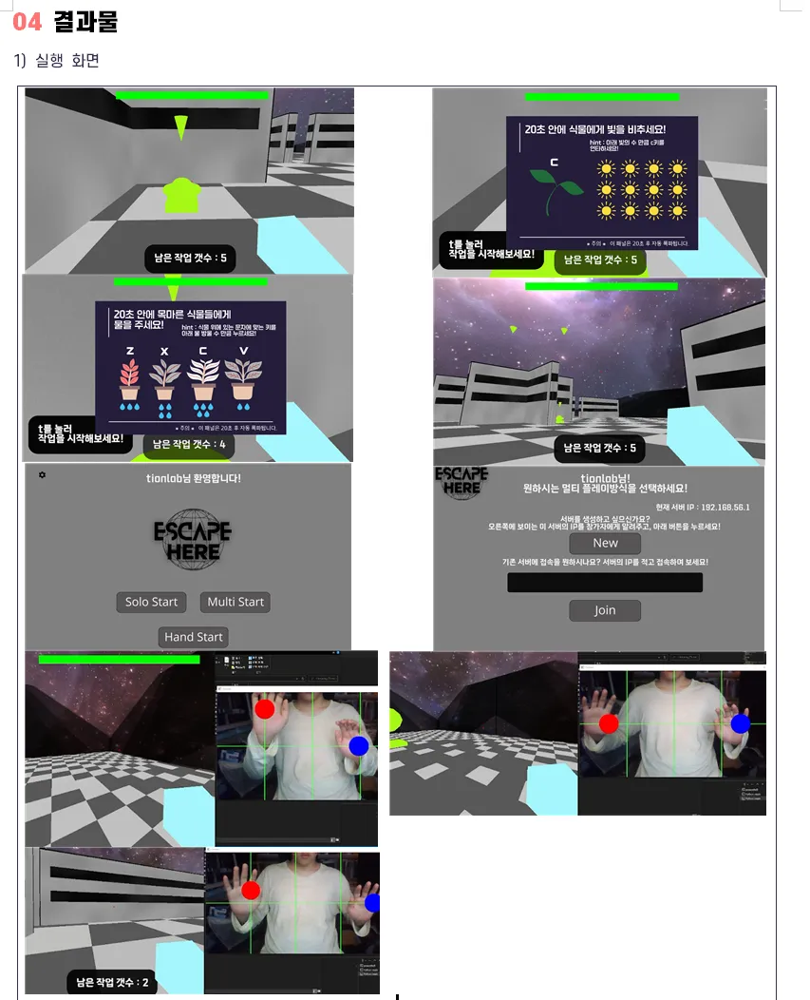

# 🏃🏻‍♂️‍➡️ Escape Here
Python 기반 3D 멀티 총 게임
## 프로젝트 소개

## 데모

    

    

## 개발 배경
지구온난화가 점점 심각해지고 있다는 것에 경각심을 일깨우기 위하여 게임에서 자연보호와 관련된 내용을 다뤄 자연 보호를 유도하고자 개발하게 되었습니다.
그리고 Python을 사용하여 과연 이러한 3D 멀티 게임을 어디까지 구현할 수 있을지 의문이 들어 개발을 하게 되었습니다.

## 스토리
> 점점 심해지는 지구 온난화로 인해 뜨거워지는 지구를 살리기 위해 4명의 연구원들은 온실가스를 대량 흡입하는 슈퍼 식물을 연구하여 이 문제를 대처하려 하였다. 연구원들은 혹시 모를 변수로 인한 인명 피해가 예상되어, 우주 연구실로 가게 된다. 예상하였듯이, 우주에서 변수가 발생하게 되었고 이로 인하여 슈퍼 식물은 성장을 멈추지 않고 다른 생물체에게 공격성을 띄게 된다. 이로 인해, 연구원들은 지구로 빠른 복귀를 하려 하였으나, 귀환 장치가 고장난 상태였다. 이런 상황을 대비하여 비상 탈출 장치가 제작되어 있었으나, 장치의 개수는 단 하나. 결국 연구원들은 지구로 돌아갈 수 있는 마지막 희망인 비상 탈출 장치를 사용하기 위해 원치 않았던 내부 분열이 일어나게 되는데...

## 개발 목표
1.  Python으로만 3D 멀티 게임을 제작

흔히 Python 게임을 제작할땐 pygame 라이브러리를 사용하여 
게임을 제작하기 때문에 3D와 같은 부분은 2D를 3D처럼 보이게 하는 
Fake 3D로 구현해야만 했습니다. 하지만 EscapeHere은 파이썬 게임엔진 중 하나인 Ursina를 사용하여
3D를 구현하였으며 Socket을 사용하여 서버와 통신하게끔 개발하여 멀티를 지원하도록 개발하였습니다.

2.  자연 보호 유도

게임의 스토리와 게임 내 작업 컨탠츠에서 자연과 연계된 내용을 포함하여 
자연보호를 유도하게끔 설계하였습니다.

3. 흥미로움과 신기함 추구

>이 레포지토리에서 다루지 않습니다. 유의사항 참고

자연 보호 유도 효과를 극대화하기 위해선 게임에 대한 흥미로움이나 신기한 요소가 필요하다고 생각하게되어,
키보드와 마우스가 필요하지 않는 손 인식 모드를 개발하여 기존에는 해보지 못하였던 방식으로 
게임을 플레이하여 흥미로움을 이끌 수 있도록 개발하였습니다.

## 주요 기능
1. 멀티 플레이

멀티 플레이는 크게 2가지의 종류로 자신이 서버를 열거나 다른 사람이 연 서버에 
접속하여 플레이 하게 됩니다. 멀티로 접속하였을때엔 먼저 작업을 모두 완수하여 탈출한 사람이 승자가 되게 되며, 이를 방지하기 위해 마우스 클릭으로 총을 
발사하여 방해할 수 있습니다.

2. 솔로 플레이 

>이 레포지토리에서 다루지 않습니다. 유의사항 참고

일반적인 게임 플레이 방식으로 작업 컨텐츠 내부에 자연과 연계되있는 내용들을 추가하여 자연보호를 유도하게끔 되어있습니다.

3. 손인식 플레이

>이 레포지토리에서 다루지 않습니다. 유의사항 참고

특색있는 게임 플레이 방식으로 키보드나 마우스를 만지지 않고 허공에 손을 들어, 화면에 공을 움직여 게임 속 아바타가 그에 따라서 움직이게끔 하는 방식입니다. 다른 플레이 방식과는 다르게, 키 입력에 제한이 어느정도 있다는 점으로 인하여 추가적인 작업 컨탠츠는불가능하며 대신 작업을 할 수 있는 곳에 근접해 있을시 자동으로 완료처리가 됩니다.

## 개발 기획서 및 프로젝트 설명서
[개발 기획서](https://tionlabs.notion.site/escape-here)

## 유의 사항
해당 레포지토리에 공개되어져 있는 소스코드는 정식 프로젝트의 내용만 담겨져있습니다. 추가적으로 진행한 메인화면 UI 개선, 유저 서버 개설 편리화, 컨트롤러 없는 제스처 컨트롤 구현 등의 기능은 현재 이 소스코드로는 사용하실 수 없으며 추가적으로 개발되었던 소스코드는 현재 원본이 삭제되어 컨트롤러 없는 제스처 컨트롤의 극 초기 테스트 단계의 코드만 복구가 되고 나머지는 복구가 어려워 업로드하지 못한 점 양해 부탁드립니다.

## 기여자
타티온(@tionlab)

민**, 선***(@H4SE0N), 김**

## Special Thanks

1. [MysteryCoder456](https://github.com/MysteryCoder456/UrsinaFPS) - Ursina FPS System and Server-User Socket System
2. [Richard Whitelock](https://distantlantern.itch.io) - Amazing Looking Skybox
3. [Jestan](https://jestan.itch.io) - Tile Textures